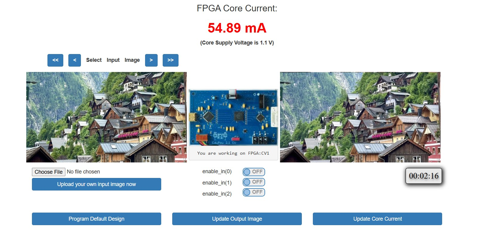

[README.md](https://github.com/user-attachments/files/32197293/README.md)
# 🚗 Lane Detection on FPGA — FPGA Vision Remote Lab


<!-- Replace with your actual image paths -->

A 3-month open-access course project in digital FPGA design, completed remotely through the **FPGA Vision Remote Lab** at **Hochschule Bonn-Rhein-Sieg (H-BRS), Germany**. All designs were developed and validated on real FPGA hardware — programmed and operated entirely remotely via server infrastructure.

---

## About the Lab

The **FPGA Vision Remote Lab** enables students worldwide to work with real FPGA boards over the internet. The setup involves:

- Programming FPGAs with bitstreams remotely
- Passing input images to the FPGA and capturing output images from it
- Testing real hardware without physical access to the lab

More about the lab: [Prof. Dr. Marco Winzker — YouTube Channel](https://www.youtube.com/@MarcoWinzker)

**Source files by Prof. Dr. Marco Winzker:** https://lnkd.in/gj78ENVT

---

## Hardware

| Board | Technology |
|---|---|
| Intel Cyclone V | Altera/Intel FPGA |
| Additional H-BRS Remote Lab Boards | Various FPGA platforms |

All designs implemented in **VHDL**.

---

## Experiments

### Experiment 1 — Edge Detection for Lane Detection


Implemented **Sobel matrix-based edge detection** for identifying lane markings in images. This forms the core of the lane detection pipeline.

**Key concepts:**
- Video pipelining for real-time image processing
- Sobel operator applied in hardware
- Output routed back through the remote lab infrastructure for verification

---

### Experiment 2 — FIR Filter for Image Sharpening



Designed and validated a **FIR (Finite Impulse Response) filter** on FPGA for a sharpness filter applied to the input image stream.

**Key concepts:**
- FIR filter architecture in VHDL
- Hardware multiply-accumulate pipeline
- Comparison of input vs. filtered output images

---

### Experiment 3 — Sleep Mode via Temporal Scanning


Implemented a **power-saving "sleep mode"** using temporal scanning to disable the top 270 lines of the image frame. This novel approach reduces active processing cycles and demonstrates practical power–performance trade-offs on FPGA.

> *"Great work and the use of temporal scanning to disable the top 270 lines is a novel idea."*
> — Course Feedback

**Key concepts:**
- Finite State Machine (FSM) for sleep mode control
- Line counter logic to selectively disable pixel processing
- Power efficiency without dedicated power management hardware

---

## 🌟 Course Highlights

| Topic | Description |
|---|---|
| Image Processing | Video pipelining fundamentals |
| Edge Detection | Sobel matrix for lane detection |
| FIR Filters | Hardware sharpness filter |
| Power Efficiency | Sleep mode via temporal scanning |
| Machine Learning | Sign board detection on FPGA |

---

## 📁 Project Structure

```
├── experiment1_edge_detection/
│   └── sobel_edge_detect.vhd
├── experiment2_fir_filter/
│   └── fir_filter.vhd
├── experiment3_sleep_mode/
│   └── sleep_mode_fsm.vhd
├── images/
│   ├── experiment1.jpg
│   ├── experiment2.jpg
│   └── experiment3.jpg
└── README.md
```

---

## 🙌 Acknowledgements

Many thanks to:

- **[Andrea Schwandt](https://www.linkedin.com/in/a-schwandt/)** — for the invaluable opportunity through the FPGA Vision Remote Lab
- **[Prof. Dr. Marco Winzker](https://www.linkedin.com/in/winzker/)** — Bonn-Rhein-Sieg University of Applied Sciences, Germany — for the course design and the remote lab setup which provided realistic exposure to FPGA implementation and power–performance trade-offs

---

## 📄 License

Source files for the course framework are provided by Prof. Dr. Marco Winzker. Please refer to the [original repository](https://lnkd.in/gj78ENVT) for licensing terms.
